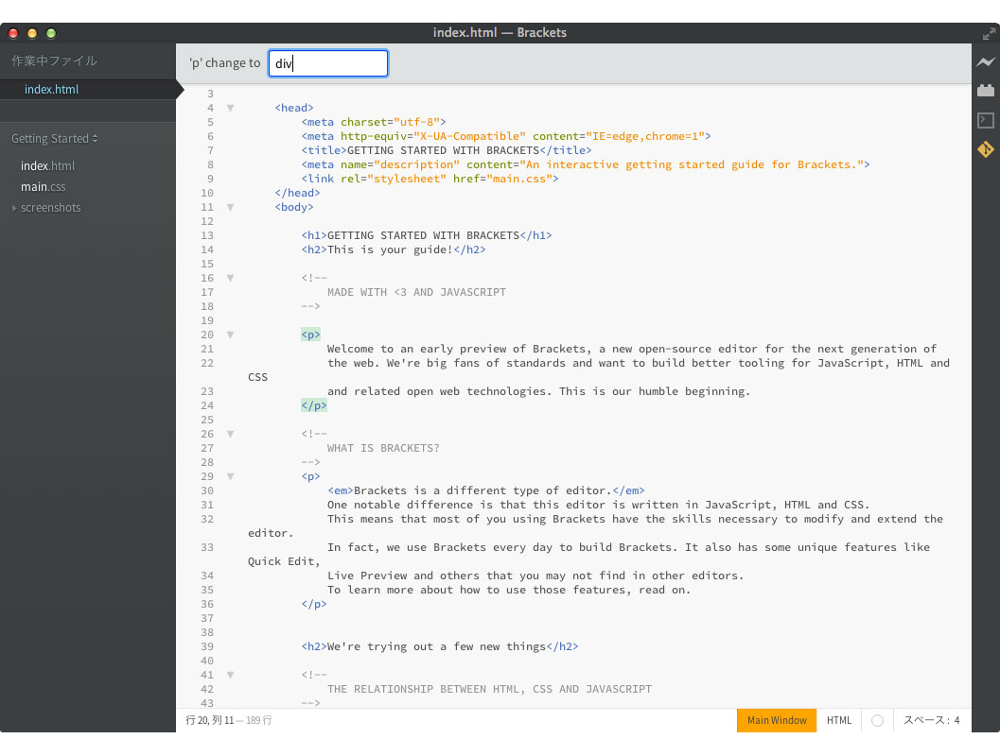
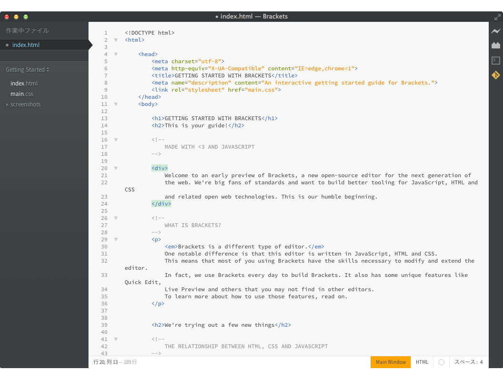

Brackets-TagRenamer
===================
An (Adobe Brackets)[http://github.com/adobe/brackets] extension.  
Rename Open/Close tag names.

## Usage
Press _Ctrl+Shift+R_ on the tag name.  
Type new tag name and Press _Enter_ to rename tag name.
  
